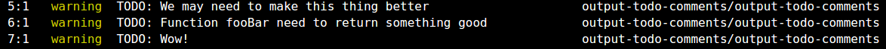

# eslint-plugin-output-todo-comments [](https://badge.fury.io/js/eslint-plugin-output-todo-comments)
Contains single rule that warns about used warning comments and shows them as they are.

This plugin contains stupidly copy-pasted **no-warning-comments** rule with one little modification: it shows warn comment as it is instead of showing meaningless warning "Unexpected 'todo' comment". [Check out original documentation for no-warning-comments](http://eslint.org/docs/rules/no-warning-comments).

```js
// TODO: We may need to make this thing better
// TODO: Function fooBar need to return something good
// TODO: Wow!
```



The plugin doesn't include any tests and it's created as quick and dirty solution for my internal needs.

## Install
```
npm install -D eslint-plugin-output-todo-comments
```

## Usage
```js
module.exports = {
    "plugins": ["output-todo-comments"],
    "rules": {
        'output-todo-comments/output-todo-comments': [
            'warn', {
                'terms': ['todo'],
                'location': 'start',
            }
        ],
    }
}
```
